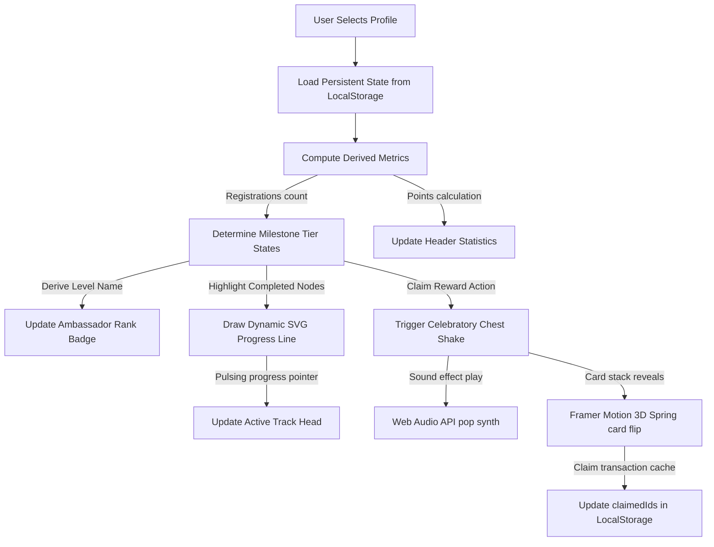
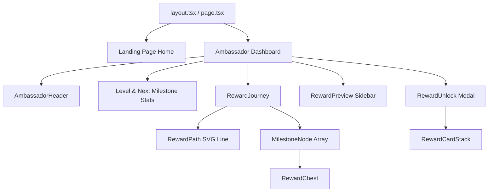

# 🏆 EYFI Reward Journey

A premium, interactive, and gamified campus ambassador rewards dashboard built for the **EYFI** ecosystem. The application tracks active scout registration milestones and rewards student leaders through unlockable tiers, paid summer internships, merchandise, and founding member tokens.

This is a high-fidelity frontend prototype built as part of the **Polygnan EYFI Reward Ladder** assignment.

---

## 🔗 Live Demo
Explore the interactive prototype live:
👉 **[EYFI Reward Journey Live Demo](https://eyfi-reward-journey-polygnan.vercel.app/)** 
---

## 💡 Key Features
- **High-Fidelity Campaign Landing Page**: Centered layout mirroring corporate visual aesthetics, complete with infinite scrolling orange gradients, custom badge SVGs, and absolute-positioned 3D rotating Rupee coins.
- **Dynamic Ambassador Simulator**: A header workspace that allows toggling between three default student profiles. Registration statistics mutate instantly and recalculate ladder states, points, and tiers on-the-fly.
- **Horizontal Journey Path**: Custom horizontal milestones that scroll sideways on mobile viewports. Chest center coordinates connect dynamically through a custom SVG progress path.
- **Outlined Pill Controls**: Unified header toolbar buttons (Sound toggle and Reset State) sharing a sleek, matching rounded-full pill outline matching the status badges.
- **Premium Audio Synthesizer**: Custom built-in Web Audio API synthesizer that plays subtle, zero-latency chest popping sounds and sparkling pentatonic chords without downloading heavy audio files. Exposes a responsive Sound/Muted toggle with session persistence.
- **Buttery-Smooth 3D Collectibles**: Unlocked chest packages open to trigger radial particle explosions and reveal collectible trading cards. The trading cards flip in 3D using organic Framer Motion spring physics, hover-tilt rotation, and float controls.
- **Consistent Claim States**: Achievements are logged dynamically with active **Claim Reward** options that cache status to `localStorage` securely. Claimed items transition into a beautiful translucent green button, keeping in line with the brand theme.

---

## 🛠️ Technology Stack
- **Framework**: [Next.js (v16.2.12)](https://nextjs.org/) (App Router, React 19)
- **Styling**: [Tailwind CSS (v4.0)](https://tailwindcss.com/)
- **Animations**: [Framer Motion](https://www.framer.com/motion/) & custom CSS keyframes
- **Icons**: [Lucide React](https://lucide.dev/)
- **Audio System**: Web Audio API (Dynamic signal processing/synthesizer oscillators)
- **State Management**: React state hooks synchronized with SSR-safe `localStorage` cache

---

## 📊 User Progression & State Flow



---

## 📁 Project Architecture & Components Map



```text
├── public/
│   └── assets/
│       └── mascots/            # 13 high-quality mascot illustrations (mascot-1.png to mascot-13.png)
├── src/
│   ├── app/                    # Next.js App Router Pages
│   │   ├── layout.tsx          # Production-grade head metadata and OpenGraph tag setups
│   │   ├── globals.css         # Custom neon glows, repeating dot-grids, and scroll marquee keyframes
│   │   ├── page.tsx            # High-fidelity campaign landing page
│   │   └── dashboard/
│   │       └── page.tsx        # Main ambassador workspace page
│   ├── components/             # Modular component layout directories
│   │   ├── ui/                 # Reusable design system elements
│   │   │   ├── Button.tsx      # Accessible multi-variant click helper with loading anims
│   │   │   ├── Badge.tsx       # Color status tags with neon shadowing glow effects
│   │   │   ├── GlassCard.tsx   # Glassmorphism border panel with blur backdrops
│   │   │   ├── Progress.tsx    # Dynamic progress bar tracking percentage loads
│   │   │   ├── MascotDisplay.tsx # Optimized float container for mascot artwork rendering
│   │   │   └── RupeeCoin.tsx   # 3D-rendered SVG coin representing Indian Rupee (₹)
│   │   └── reward-journey/     # Gamified milestone widgets
│   │       ├── RewardChest.tsx     # Gift box presenter (locked, active, claimed)
│   │       ├── MilestoneNode.tsx   # Progression node along the horizontal axis
│   │       ├── RewardPath.tsx      # Connecting progression overlay tracker SVG
│   │       ├── RewardPreview.tsx   # Responsive card showing perks list (sidebar/cards)
│   │       ├── RewardCardStack.tsx # 3D trading card displaying perks with flip animations
│   │       └── RewardUnlock.tsx    # Celebration overlay chest opening & sparks burst modal
│   ├── data/                   # Consolidated datasets
│   │   ├── ambassador.ts       # Multi-profile stats database config (Raju, Farhan, Rancho)
│   │   └── rewards.ts          # The 6 levels of rewards criteria (Scout to Founding Team)
│   ├── utils/                  # Calculation helper modules
│   │   ├── cn.ts               # Tailwind class merging tool
│   │   ├── progression.ts      # Isolated logic determining locks, active levels, and milestones
│   │   ├── persistence.ts      # LocalCache read/write hooks syncing scout edits and claim history
│   │   └── audio.ts            # Web Audio API sound synthesis and mute persistence config
```

---

## 🎨 Design Decisions & Product Thinking

### 1. Glassmorphism & Lime-Green Neon Palette
The application integrates a sleek, premium dark-mode theme paired with bright EYFI lime-green neon accents (`#A3E635`). Cards utilize semi-translucent backdrops and high blur levels (`backdrop-blur-md`) to separate details panels from the animated background dot-grid without looking cluttered.

### 2. Audio Synthesis vs. Static Asset Downloads
To prevent delay/latency issues when playing reward triggers, sound effects are generated dynamically via the **Web Audio API**. A bass-frequency pitch sweep (`150Hz -> 45Hz` triangle oscillator) synthesizes a physical "pop" when opening a chest box, and a pentatonic arpeggio (`C5 -> E5 -> G5 -> C6` sine waves) plays as a chime when cards are revealed. This eliminates server downloads and works offline with zero network latency.

### 3. SVG Path Center Anchoring
Milestones render with varying text labels which can cause text-wrapping shifts on small screens. Rather than drawing the progress line along simple margins, we re-centered coordinates (`left-[48px] right-[48px] top-[80px]`) relative to the cards' horizontal centers. The path is guaranteed to connect chests dynamically, keeping alignment clean across mobile, tablet, and desktop viewports.

### 4. Interactive Z-Index Cards Layering
To prevent visual clipping, flicker, or fading during card flips, front and back collectible sides are layered using dynamic z-indices (`isFlipped ? 2 : 1`). Both sides render in full 3D throughout the flip lifecycle, and double-clicks are blocked using state locks while transitions run.

---

## 🗺️ Sprint Timeline Summary

- **Sprint 0: Setup** — Initialized Next.js, set up directory structures, imported the mascot asset packs, and configured Tailwind variables.
- **Sprint 1: Tokens** — Formed UI helpers, glass cards, buttons, badges, and responsive metadata structures.
- **Sprint 2: Profiles** — Created welcome headers, campaign metrics blocks, and populated default ambassador profiles.
- **Sprint 3: Ladder** — Built horizontal paths, milestone nodes, and active preview sidebars.
- **Sprint 4: Celebration** — Programmed chest shakes, 3D flip card stacks, spark particle bursts, and modal overlays.
- **Sprint 5: State** — Integrated profile switchers, localStorage synchronizations, and claim transactions.
- **Sprint 6: Polish** — Configured dynamic ranks, Web Audio chimes, outlined pill styles, and pre-deployment QA sweeps.

---

## 📈 Future Enhancements
- **Multiplayer Campus Leagues**: Live leaderboards comparing ambassador points across colleges in India.
- **Social Share Engine**: One-click sharing for ambassadors to publish unlocked 3D cards and milestones on LinkedIn/Twitter.
- **Custom Mascot Customization**: Ability for student leaders to customize visual clothing and accessories on their unlocked campus mascots.
- **Web3 Reward Contracts**: Dynamic smart contract claiming for founding member tokens and NFT-based digital certificates.

---


## 🚀 Getting Started

### 1. Install Dependencies
```bash
npm install
```

### 2. Configure Environment Variables
```bash
cp .env.example .env.local
```

### 3. Run Development Server
```bash
npm run dev
```
Open **[http://localhost:3000](http://localhost:3000)** in your browser to view the app.

### 4. Build Production Bundle
```bash
npm run build
```
